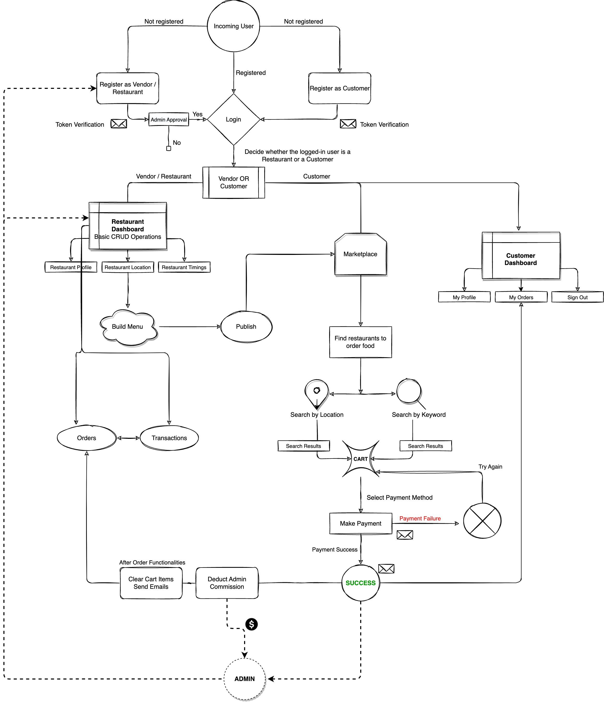

# Python commands

## This is to create virtual env

```python
> python3 -m venv env

> source env/bin/activate

> deactivate (to come out of that env)

> pip3 freeze (To check all the installed dependencies)

> cmd+shift+p create virtual env and open bash to have venv specific to project

> pip3 install django and check pip3 freeze
```

# Django Refresher

## Inside .venv i.e bash

## cd into the foodOnline folder

## To create boiler plate django code

```python
> django-admin startproject projectname .

> e.g django-admin startproject foodOnline_main .
```

## To run the django code

```python
> python3 manage.py runserver
```

## To access the admin console

```python
> localhost:8080/admin

> For username and password run below command
> python manage.py migrate
> python3 manage.py createsuperuser

username: djangoadmin
email: djangoadmin@gmail.com
pass: Asgi!123
```

## To link it to templates folder.

1. Create a templates folder and add html files.
2. In setting.py inside TEMPLATES --> DIRS --> 'templates' folder name which is created
3. Update the urls.py to add home url which links to a method in view
4. Inside this view create a method named in urls.py and add a render function pointing to home.html inside templates folder

## Static File Linking

1. create a static folder inside project folder
2. Inside setting.py add below lines
   ```python
    STATIC_ROOT = BASE_DIR /'static'
    STATICFILES_DIRS =[
        'foodOnline_main/static'
    ]
   ```
3. Inside home.html in the start of line add this ****
4. Then for every static file load static using templating
   ```htm
   <!-- CSS -->
   <link href="" rel="stylesheet" />
   <link href="" rel="stylesheet" />
   <link href="" rel="stylesheet" />
   <link
     rel="stylesheet"
     href="https://stackpath.bootstrapcdn.com/bootstrap/4.3.1/css/bootstrap.min.css"
   />
   <link href="" rel="stylesheet" />
   ```
5. python manage.py collectstatic (to collect static files outside of folder this is used in production didnt understand properly)

## To Setup a DB

1. Install a postgress sql and open pgadmin
2. Create a db inside postgress sql with name foodOnline_db
3. Inside Settings.py go to database section and add the following
   ```python
   DATABASES = {
       'default': {
           'ENGINE': 'django.db.backends.postgresql',
           'NAME': 'foodOnline_db',
           'USER': 'postgres',
           'PASSWORD': config('DB_PASSWORD'), # This will come from .env refer python decouple section in this readme
           'HOST': 'localhost'

       }
   }
   ```
4. Install psycopg2 library to work with python
   ```python
   pip3 install psycopg2
   ```
> Since we moved from sql3 db to postgres sql we have to run the below commands again
1. python manage.py migrate
2. python3 manage.py createsuperuser
3. Inside auth_user table inside postgres sql you can check new super user is created

## Since we have sensitive information like password to connect to sql db we cannot push it to git So python provides a package called decouple
1. pip install python-decouple
2. from decouple import config
3. Sample to retrieve the configurations from .env file
```python
SECRET_KEY = config('SECRET_KEY')
DEBUG = config('DEBUG', default=False, cast=bool)
EMAIL_HOST = config('EMAIL_HOST', default='localhost')
EMAIL_PORT = config('EMAIL_PORT', default=25, cast=int)
```


## To create django app

```python
> python3 manage.py startapp employees

```

## After creating the model objects and adding it into setting.py run the below command to migrate models to tables

```python
> python3 manage.py makemigrations (This will create a sql file in migrations folder)

> python3 manage.py migrate (This will actually create database)
```

# DjangoPriyasRestaurant


